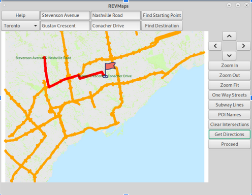
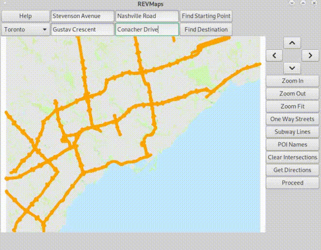

# GISMapperECE297Public
This is a public readme of the ECE297 mapper project. Over the course of the semester, my two other teammates and I worked on our own mapper using the OpenStreetMap API as well as an API provided by the course. Due to academic integrity regulations, I can't share the code, but I'm happy to discuss it with anyone interested.

## The Mapper

As mentioned earlier, the project gets data from two different APIs. We were then responsible for organizing the data by sleecting data structures to make the program as responsive as possible, so that loads times and functions didn't make people wait too long. 

There were different features we were required to implement, as well as a few that we chose to ourselves. 

At the end of the term, our mapper was able to display basic things like roads, buildings, points of interest, natural features, street names. You could use it to find a path from one intersection to another using the A* algorithm. It could also display subways if the user decided by using a button to toggle the display. 

Our final milestone was the travelling courier problem. Using a combination of a basic greedy algorithm, multi-dijkstra, 2-swap and 2-opt, and simulated annealing, the mapper was able to find a solution for the best route for multiple pick ups and drop offs. 

## Pictures and Videos

While I can't show the code, I can show the final result of project. 

The user could select different maps using the drop down menu. Buttons for zooming in and out, moving around the map, and other display toggles were on the right. In the top left corner there is a help button that generates pop ups to give users information on how to use the interface. 

Here, the program used A* to find a path between those two intersections. 

.gif)

And here, a user toggles the subways displayed on the map of Toronto. 

For our final presentation, I added a bit of code to display how A* actually works. It was just a small thing to help with our explanation, but I thought I'd show it here too because I think it looks really cool :) 

